# OSS Contribution Card

GitHub 프로필 README에 **외부 레포지토리 기여 내역**을 자동으로 표시하는 위젯입니다.

자신의 레포가 아닌, 다른 프로젝트(오픈소스 등)에 **merge된 PR**만 표시합니다.

## Preview

### Light


### Dark


### Nord


### Dracula


### Tokyo Night


## Features

- **외부 기여만 표시** - 자기 레포 제외, 다른 프로젝트에 merge된 PR만
- **자동 업데이트** - GitHub Actions로 매일 자동 갱신
- **5가지 테마** - light, dark, nord, dracula, tokyo
- **애니메이션** - 부드러운 fade-in 효과
- **반응형** - compact 모드 지원

## 사용 방법

### 1. 프로필 레포지토리에 파일 복사

`username/username` 레포지토리(프로필 README 레포)에 다음 파일들을 복사합니다:

```
your-username/
├── .github/
│   └── workflows/
│       └── update-contributions.yml
├── src/
│   ├── index.js
│   ├── fetch-contributions.js
│   └── generate-svg.js
└── package.json
```

### 2. GitHub Actions 권한 설정

레포지토리 **Settings → Actions → General**에서:
- **Workflow permissions**: "Read and write permissions" 선택
- Save 클릭

### 3. README.md에 SVG 추가

프로필 README.md에 다음을 추가합니다:

```markdown
## Open Source Contributions


```

### 4. 수동 실행 (선택)

처음 설정 후 바로 확인하고 싶다면:
1. 레포지토리 → **Actions** 탭
2. "Update Contributions SVG" 워크플로우 선택
3. **"Run workflow"** 클릭

## 설정 옵션

### 테마 변경

레포지토리 **Settings → Secrets and variables → Actions → Variables**에서:

| Variable | Description | Options | Default |
|----------|-------------|---------|---------|
| `THEME` | 테마 선택 | `light`, `dark`, `nord`, `dracula`, `tokyo` | `light` |
| `MAX_REPOS` | 표시할 최대 레포 수 | 1-10 | `5` |

### 로컬 실행

```bash
# 기본 실행
node src/index.js <username>

# 테마 지정
THEME=dark node src/index.js <username>

# 모든 옵션
GITHUB_USERNAME=dbwls99706 \
THEME=tokyo \
MAX_REPOS=3 \
OUTPUT_PATH=./my-contributions.svg \
node src/index.js
```

## 동작 원리

```
┌─────────────────────────────────────────────────────────┐
│  GitHub Actions (매일 UTC 00:00 자동 실행)               │
├─────────────────────────────────────────────────────────┤
│                                                         │
│  1. GitHub Search API 호출                              │
│     → author:{username} type:pr is:merged -user:{user}  │
│     → 자기 레포 제외, merged PR만                        │
│                                                         │
│  2. 레포별로 그룹화 & PR 수 기준 정렬                    │
│                                                         │
│  3. SVG 카드 생성 (애니메이션 포함)                      │
│                                                         │
│  4. contributions.svg 커밋 & 푸시                        │
│                                                         │
└─────────────────────────────────────────────────────────┘
```

## API 제한

- GitHub Search API: 인증 없이 분당 10회, 토큰 사용 시 분당 30회
- GitHub Actions에서는 자동으로 `GITHUB_TOKEN`을 사용하므로 제한 걱정 없음

## License

MIT
