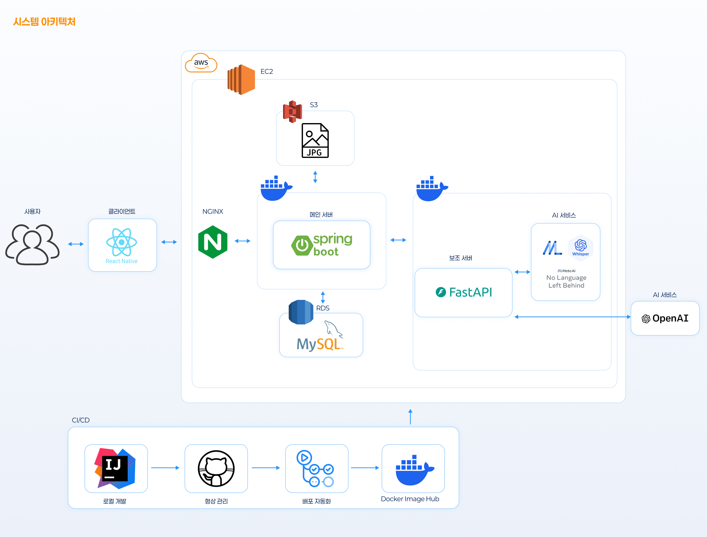

✍️Tech Stacks
---
   

⚙️ Projects
---
1. **[DOCKin](https://github.com/DOCKin-project)**(2025 ~ 진행중)

- 개요: 조선소 근로자를 위한 AI 음성 인식, 다국어 번역, 안전·근태 관리를 통합한 모바일 앱
- Spring Boot, Java, MySQL
- Spring WebFlux 기반 비동기 실시간 챗봇, 실시간 번역 API게이트웨이 구축
- STOMP 프로토콜과 Pub/Sub 모델을 적용하여, 채팅방 별 메시지 라우팅 구조를 체계화하고 서버의 메시지 처리 부하를 효율적으로 관리
- AWS CI/CD 파이프라인 구축 및 S3 파일 업로드 구현
- [트러블 슈팅 및 실패 기록](https://github.com/DOCKin-project/DOCKin-backend/wiki)

⚙️ Open Source Contribution
---
- spring-projects/spring-ai #5297 - Elasticsearch IN/NIN 연산자 괄호 오류 수정 

⚙️ Algorithm
---

🎨 Activities
---

|Type| Contents | 내용 | Date |
| :---| :--- | :--- | :--- |
| 대회| 충남 대학 연합 창업경진대회 | 장려상 | '24. 11. 13. |
| 패널| 하나은행 소비자패널 | Researcher | '25. 03. 01. ~ '25. 12. 31.|
| 대회| 신협 신사업아이디어공모전 | 우수상 | '25. 09. 24. |
| 해커톤| 2025 k조선 해커톤| 산업통상자원부장관상 | '25. 09. 08. ~ '25. 11. 22. |
| 대회| 상명대학교 2025학년도 창업경진대회(기술창업 부문)| 우수상 | '25. 12. 19. |

📝 Certificate
---
⦁ Adsp ('25.02. )

