# OSS Contribution Card

GitHub 프로필 README에 **외부 레포지토리 기여 내역**을 자동으로 표시하는 위젯입니다.

자신의 레포가 아닌, 다른 프로젝트(오픈소스 등)에 **merge된 PR**만 표시합니다.

## Preview

### Light


### Dark


## Features

- **외부 기여만 표시** - 자기 레포 제외, 다른 프로젝트에 merge된 PR만
- **자동 업데이트** - GitHub Actions로 매일 자동 갱신
- **5가지 테마** - light, dark, nord, dracula, tokyo
- **PR 번호 표시** - 각 카드에 PR 번호(#123) 표시
- **정렬 옵션** - 날짜순 또는 PR 수 기준 정렬
- **날짜 필터** - 최근 N개월 기여만 표시 가능
- **애니메이션** - 카드 페이드인 효과

## 사용 방법

### 1. 프로필 레포지토리에 파일 복사

`username/username` 레포지토리(프로필 README 레포)에 다음 파일들을 복사합니다:

```
your-username/
├── .github/
│   └── workflows/
│       └── update-contributions.yml
├── src/
│   ├── index.js
│   ├── fetch-contributions.js
│   └── generate-svg.js
└── package.json
```

### 2. GitHub Actions 권한 설정

레포지토리 **Settings → Actions → General**에서:
- **Workflow permissions**: "Read and write permissions" 선택
- Save 클릭

### 3. README.md에 SVG 추가

프로필 README.md에 다음을 추가합니다:

```markdown
## Open Source Contributions


```

### 4. 수동 실행 (선택)

처음 설정 후 바로 확인하고 싶다면:
1. 레포지토리 → **Actions** 탭
2. "Update Contributions SVG" 워크플로우 선택
3. **"Run workflow"** 클릭

## 설정 옵션

레포지토리 **Settings → Secrets and variables → Actions → Variables**에서 설정:

| Variable | Description | Options | Default |
|----------|-------------|---------|---------|
| `THEME` | 테마 선택 | `light`, `dark`, `nord`, `dracula`, `tokyo` | `light` |
| `MAX_REPOS` | 표시할 최대 PR 수 | 1-10 | `6` |
| `TITLE` | 커스텀 타이틀 | 문자열 | `Open-Source Contributions` |
| `SORT_BY` | 정렬 기준 | `date` (최신순), `count` (PR 많은 순) | `date` |
| `MONTHS_AGO` | 최근 N개월 필터 | 숫자 (예: `6`) | 전체 |

### 예시: 다크 테마 + 최근 6개월만 표시

```yaml
env:
  THEME: dark
  MAX_REPOS: 4
  SORT_BY: date
  MONTHS_AGO: 6
```

### 로컬 실행

```bash
# 기본 실행
node src/index.js <username>

# 테마 + 정렬 옵션
THEME=dark SORT_BY=count node src/index.js <username>

# 최근 6개월만
MONTHS_AGO=6 node src/index.js <username>

# Mock 데이터로 테스트
node src/index.js <username> --mock
```

## 테마 미리보기

| Theme | Preview |
|-------|---------|
| `light` | 밝은 배경 + 초록 액센트 |
| `dark` | 어두운 배경 + 연두 액센트 |
| `nord` | Nord 팔레트 |
| `dracula` | Dracula 팔레트 |
| `tokyo` | Tokyo Night 팔레트 |

## 동작 원리

```
┌─────────────────────────────────────────────────────────┐
│  GitHub Actions (매일 UTC 00:00 자동 실행)               │
├─────────────────────────────────────────────────────────┤
│                                                         │
│  1. GitHub Search API 호출                              │
│     → author:{username} type:pr is:merged -user:{user}  │
│     → 자기 레포 제외, merged PR만                        │
│                                                         │
│  2. 레포별로 그룹화 & 정렬                              │
│                                                         │
│  3. SVG 카드 생성 (PR 번호, 애니메이션 포함)            │
│                                                         │
│  4. contributions.svg 커밋 & 푸시                        │
│                                                         │
└─────────────────────────────────────────────────────────┘
```

## 제한 사항

- GitHub README에서 SVG 내부 링크는 보안상 비활성화됨
- PR 번호는 표시되며, 사용자가 직접 검색 가능

## License

MIT
