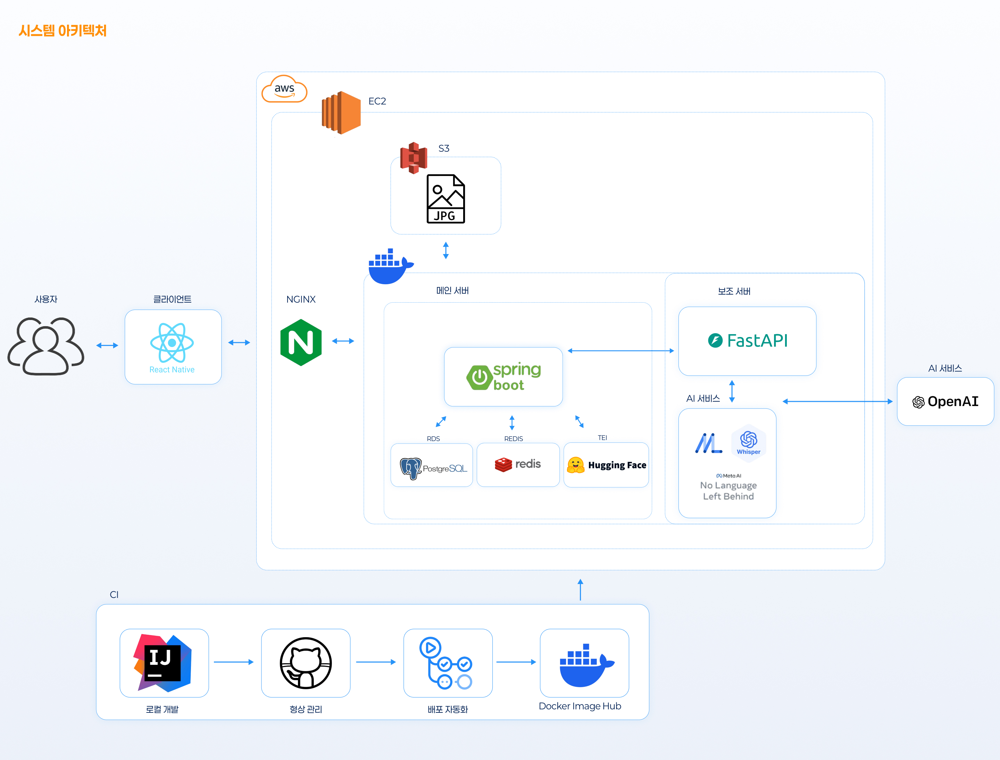

✍️Tech Stacks
---
     

⚙️ Projects
---
1. **[DOCKin](https://github.com/DOCKin-project/DOCKin-backend)**(2025.10 ~2026.01)

- 개요: 조선소 근로자를 위한 AI 음성 인식, 다국어 번역, 안전·근태 관리를 통합한 모바일 앱
-     
- 다국어 임베딩으로 **교차언어 작업일지 검색(RAG)** 구현 — 검색 쿼리에 언어 조건이 없는 구조로 다국어 언어간 양방향 검색
- 검색 권한을 **선필터**로 설계 — 후필터가 top-k를 권한 없는 문서로 채운 뒤 버리는 구조적 결함 회피
- 근태 **동시성 제어** — 출근 중복은 Redis 분산락, 연차 차감은 비관적 락으로 차단하고 경합 재현 테스트로 검증
- 브루트포스 5,165ms의 병목이 **DB가 아니라 클라이언트 전송(81%)** 임을 `EXPLAIN`으로 규명 — 인덱스 없이 계산 위치만 DB로 옮겨 57ms로 70배 단축
- `batch_size=100`이 **IDENTITY 전략에 막혀 무시되던 것**을 실측으로 확인 — 10,000건 저장에 INSERT 문장 10,000개, SEQUENCE 전환으로 배치 적용
- 컨테이너 CPU 상한이 색인을 빠르게 한다는 **자체 가설을 대조 측정으로 반증** — 상한 제거 시 17% 향상

2. **[shadowfit](https://github.com/Shadowfit/backend)**(2026.03 ~진행중) 

- 개요: 효율적인 운동 관리를 도와주는 AI 기반 개인 맞춤형 피트니스 앱
-   
- gRPC 배치 수신 → 다운샘플 → batch insert 로 실시간 관절 데이터 적재 파이프라인 구축 — 처리량 +99%, p99 −37%
- projection·keyset 페이지네이션·월별 파티셔닝으로 리포트 조회 경로 재설계 — 1억 행에서 전송량 −98.7%, 구간 삭제 66.5초 → 0.16초
- 세션 갱신 lost-update 를 재현하고 원자 UPDATE·비관적 락·낙관적 락(CAS)을 대조, upsert + 활성 세션 1개 정책 가드로 경합 제거
- 쓰기 천장의 원인을 커넥션 풀 → 커밋 fsync → 부하 분산도로 좁혀, 「천장은 fsync」가 **한 세션에 부하가 몰릴 때만** 성립함을 규명
- 「커밋을 덜 하면 빨라진다」를 반증 — 팔당 1판이라 팔과 판 순서가 섞여 있었고, 버림판 + 순서 회전으로 재측정하니 부호가 반대였다
- 백업 복구 「9초」가 디스크가 아니라 페이지 캐시를 잰 값임을 처리량 계산으로 잡아내고, 캐시 드롭 + 복구 시간 3분해로 rig 수정
- MySQL 내구성 완화가 처리량을 15% 떨어뜨린다던 이전 결과를 같은 워크로드로 4팔×4반복 재현했더니 판 간 산포 안에 묻혀 사라짐(A↔B 차이 +0.03%) — 반복 없는 1판 측정이 이전 결과 자체를 오염시켰음을 재확인
- 서킷브레이커가 AI 워커 3개(추출·시작·중단) 실패율을 하나로 합산하던 버그를 워커별로 분리 — JUnit 재현으로 "워커 1개가 멈춰도 합산 실패율이 임계값 아래라 서킷이 영원히 안 열리는 경우"와 "트래픽이 쏠리면 반대로 정상 워커까지 막히는 경우" 두 실패 모드를 확인
- 데드락 재시도 루프 지연을 처음 실측(p50 584ms, p95 2.4s, p99 3.99s) — 카운트만 재고 지연은 잰 적 없던 이전 라운드의 "수백ms" 추정을 정정, AI→Spring gRPC 데드라인(5s)에 근접함을 확인

⚙️ Open Source Contribution
---
- spring-projects/spring-ai #5297 - Elasticsearch IN/NIN 연산자 괄호 오류 수정 

- spring-projects/spring-security #18543 - AuthoritiesAuthorizationManager NPE 발생 오류 수정 

🎨 Activities
---

|Type| Contents | 내용 | Date |
| :---| :--- | :--- | :--- |
| 해커톤| 2025 k조선 해커톤| 산업통상자원부장관상 | '25. 09. 08. ~ '25. 11. 22. |

📝 Certificate
---
⦁ Adsp ('25.03. )
⦁ 정보처리기사 ('26.09. )

