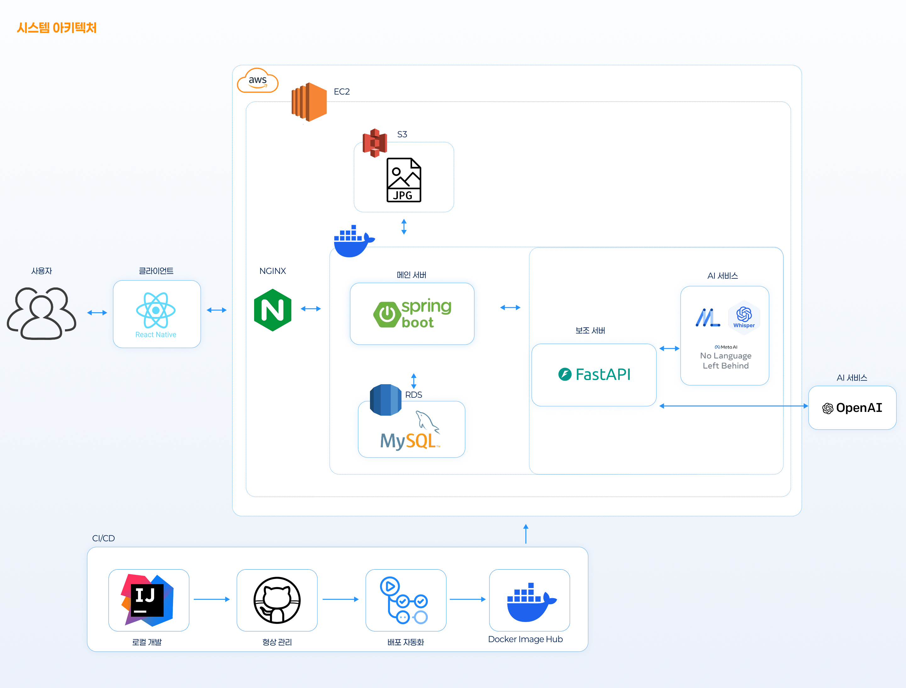
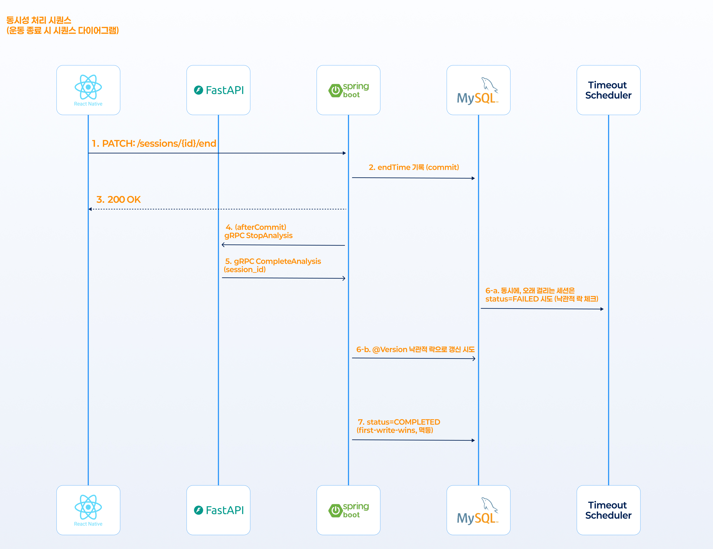

✍️Tech Stacks
---
      

⚙️ Projects
---
1. **[DOCKin](https://github.com/DOCKin-project/DOCKin-backend)**(2025.10 ~2026.01)

- 개요: 조선소 근로자를 위한 AI 음성 인식, 다국어 번역, 안전·근태 관리를 통합한 모바일 앱
-      
- 다국어 임베딩으로 **교차언어 작업일지 검색(RAG)** 구현 — 검색 쿼리에 언어 조건이 없는 구조로 한국어↔베트남어 양방향 검색
- 검색 권한을 **선필터**로 설계 — 후필터가 top-k를 권한 없는 문서로 채운 뒤 버리는 구조적 결함 회피
- 근태 **동시성 제어** — 출근 중복은 Redis 분산락, 연차 차감은 비관적 락으로 차단하고 경합 재현 테스트로 검증
- 브루트포스 5,165ms의 병목이 **DB가 아니라 클라이언트 전송(81%)** 임을 `EXPLAIN`으로 규명 — 인덱스 없이 계산 위치만 DB로 옮겨 57ms로 70배 단축
- `batch_size=100`이 **IDENTITY 전략에 막혀 무시되던 것**을 실측으로 확인 — 10,000건 저장에 INSERT 문장 10,000개, SEQUENCE 전환으로 배치 적용
- 컨테이너 CPU 상한이 색인을 빠르게 한다는 **자체 가설을 대조 측정으로 반증** — 상한 제거 시 17% 향상

2. **[shadowfit](https://github.com/Shadowfit/backend)**(2026.03 ~진행중) 

- 개요: 효율적인 운동 관리를 도와주는 AI 기반 개인 맞춤형 피트니스 앱
-   
- Spring grpc 기반 비동기 실시간 운동 관절 저장 시스템 구축
- AI 분석 결과를 페르소나별로 분기해 batch gRPC로 통합 전송하는 실시간 운동 피드백 파이프라인 구축
- 세션 데이터 기반 동기화율·구간별 정확도·이전 대비 비교를 제공하는 일별 활동 리포트 API 구현
- 부하테스트로 세션 저장 병목 실측·귀속, batch insert·keyset 페이지네이션·파티셔닝으로 대용량 조회/삭제 성능 개선
- 다중 사용자 세션 갱신 lost-update 재현 후 원자 UPDATE·비관적 락·낙관적 락(CAS)으로 정합성 확보

⚙️ Open Source Contribution
---
- spring-projects/spring-ai #5297 - Elasticsearch IN/NIN 연산자 괄호 오류 수정 

- spring-projects/spring-security #18543 - AuthoritiesAuthorizationManager NPE 발생 오류 수정 

🎨 Activities
---

|Type| Contents | 내용 | Date |
| :---| :--- | :--- | :--- |
| 해커톤| 2025 k조선 해커톤| 산업통상자원부장관상 | '25. 09. 08. ~ '25. 11. 22. |

📝 Certificate
---
⦁ Adsp ('25.02. )

