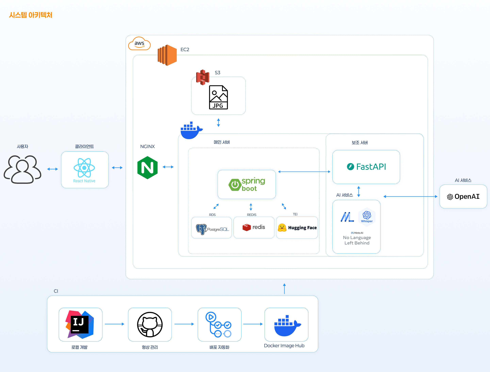
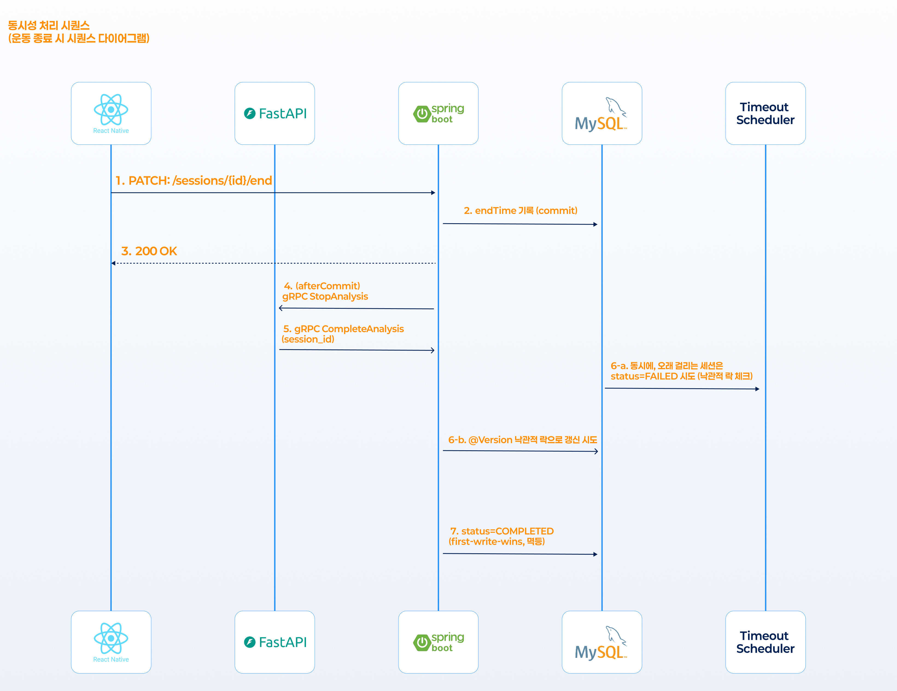

✍️Tech Stacks
---
     

⚙️ Projects
---
1. **[DOCKin](https://github.com/DOCKin-project/DOCKin-backend)**(2025.10 ~2026.01)

- 개요: 조선소 근로자용 모바일 앱. AI 음성 인식, 다국어 번역, 안전·근태 관리 기능을 한 앱에 담음
-     
- 다국어 임베딩으로 **작업일지 교차언어 검색(RAG)** 구현 — 검색할 때 언어를 따로 지정하지 않아도 어느 언어로 쓴 일지든 서로 찾을 수 있음
- 권한 필터를 **검색 전에 걸도록** 설계 — 검색 후에 거르면 상위 결과가 볼 수 없는 문서로 채워졌다가 버려져 결과가 비는 문제를 피함
- 근태 **동시성 처리** — 출근 중복은 Redis 분산 락, 연차 차감은 비관적 락으로 막고, 동시 요청을 재현하는 테스트로 검증
- 브루트포스 검색이 5,165ms 걸리던 원인을 `EXPLAIN`으로 추적 — 시간의 81%가 **DB가 아니라 클라이언트로 데이터를 보내는 데** 쓰이고 있었음. 인덱스 없이 계산만 DB에서 하도록 바꿔 57ms로 줄임
- `batch_size=100`을 설정해도 **IDENTITY 전략 때문에 배치가 안 먹히는 것**을 직접 측정해 확인(10,000건 저장에 INSERT 10,000번) — SEQUENCE 전략으로 바꿔 배치 INSERT가 동작하게 함
- '컨테이너 CPU 상한을 두면 색인이 빨라진다'고 가설을 세웠으나, **비교해 보니 오히려 상한을 없앴을 때 17% 빨랐음**

2. **[shadowfit](https://github.com/Shadowfit/backend)**(2026.03 ~진행중) 

- 개요: 운동 관리를 돕는 AI 기반 개인 맞춤 피트니스 앱
-   
- **실시간 관절 데이터 적재 파이프라인** 구축 — gRPC로 묶어 받고, 샘플 수를 줄인 뒤 한 번에 INSERT. 처리량 99% 증가, p99 지연 37% 감소
- **리포트 조회 방식** 재설계 — 필요한 컬럼만 가져오고, 키 기반 페이지네이션과 월별 파티셔닝 적용. 1억 행 기준 전송량 98.7% 감소, 기간 삭제 66.5초 → 0.16초
- 세션 갱신 중 동시 수정으로 값이 덮어써지는 문제(**lost update**)를 재현하고 원자적 UPDATE·비관적 락·낙관적 락을 비교 — upsert와 '활성 세션은 1개만' 규칙으로 충돌을 없앰
- 서킷브레이커가 AI 워커 3개(추출·시작·중단)의 실패율을 **합쳐 계산하던 버그**를 고쳐 워커별로 따로 계산하게 함 — JUnit으로 두 가지 문제 재현: ① 워커 하나가 멈춰도 전체 실패율이 기준치보다 낮아 서킷이 열리지 않음 ② 트래픽이 한 워커에 몰리면 정상 워커까지 막힘
- **데드락 재시도 지연**을 처음으로 측정(p50 584ms, p95 2.4s, p99 3.99s) — 이전에는 횟수만 세고 지연은 '수백 ms'로 짐작했는데, 실제로는 훨씬 길었고 p99가 AI→Spring gRPC 제한 시간(5초)에 가까웠음
- 쓰기 성능이 더 오르지 않는 원인을 커넥션 풀 → 커밋 시 fsync → 부하 분산 순으로 좁혀 감 — **'fsync가 병목'이라는 결론은 부하가 한 세션에 몰릴 때만 맞는다**는 것을 알아냄

⚙️ Open Source Contribution
---
- spring-projects/spring-ai #5297 - Elasticsearch IN/NIN 연산자 괄호 오류 수정 

- spring-projects/spring-security #18543 - AuthoritiesAuthorizationManager NPE 발생 오류 수정 

🎨 Activities
---

|Type| Contents | 내용 | Date |
| :---| :--- | :--- | :--- |
| 해커톤| 2025 k조선 해커톤| 산업통상자원부장관상 | '25. 09. 08. ~ '25. 11. 22. |

📝 Certificate
---
|Content| Date |
| :---|:--- |
|Adsp| '25.03. |
|정보처리기사| '26.09. |

